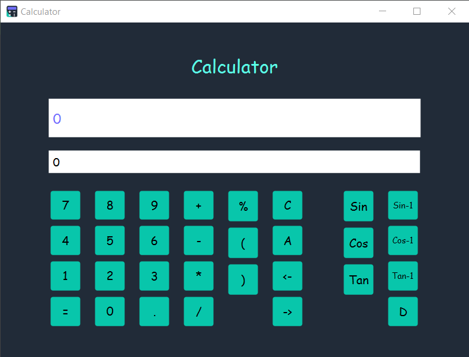
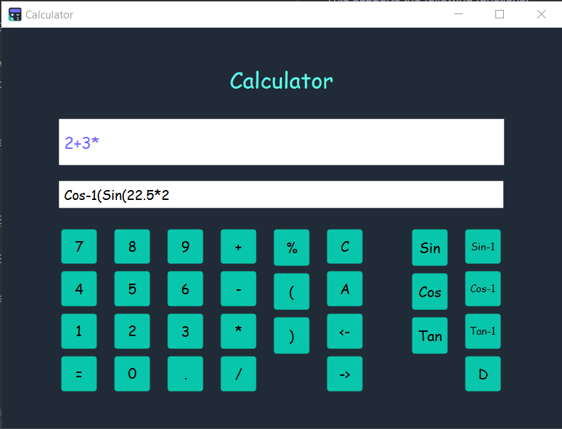

# Calculator

This calculator can be used to solve,
- +, -, *, /, % Operations
- Trigonometric functions
- Inverse trigonometric functions

This supports the following functions:
- Paranthesis
- Clear
- Backspace
- Move Cursor left, right
- Change between degrees and radians

First white box show the main equation. Small box used to solve Trigonometric functions.
That make it easy to use them, specially when you have to solve a long equation. 
Switch between main box equation and trigonometric functions box happen automatically.

For solving, First enter the equation in the main box. Then press the = button.
And the result will be shown in the main box so you can write more with it.

Supporting Format:
- This follow BODMAS rule.

ex : 2 + 3 * Cos-1(Sin(22.5*2)) / 5

* Relevant Trigonometric function solve when ) is pressed.

